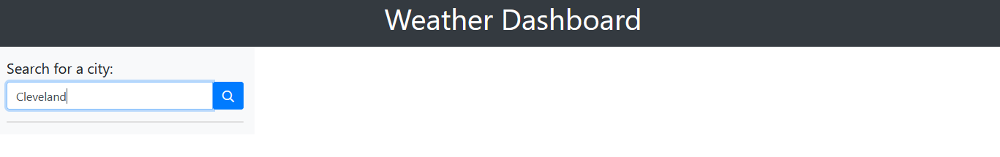
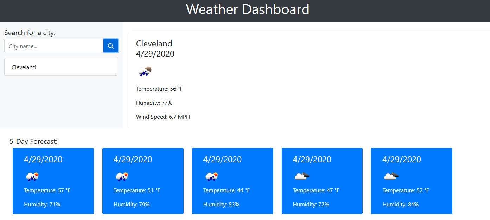
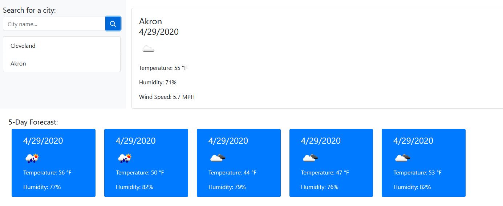

# Weather Dashboard App

A weather dashboard with search functionality to find current weather conditions and the future weather outlook for multiple cities.

### Purpose

Build my first app using an API. Retrieve data from a third-party weather API (OpenWeather API) and using it in context. 

### Functionality

Build a weather dashboard application with search functionality to find current weather conditions and the future weather outlook for multiple cities. 

[Deployed Link](https://joelynn94.github.io/weather-dashboard/) 

## App Demo

### User Input - click search 

### Displayed City Search 

### Saved Recent Searches

### Technologies Used 
- JavaScript
- OpenWeather API
- HTML
- CSS

